# **Project 1** 
## **LAMP STACK IMPLEMENTATION**
LAMP(Linux,Apache, MySQL,PHP)
### **STEP 1** - *APACHE INSTALLATION AND UPDATING THE FIREWALL*

#update a list of packages in package manager using

`sudo apt update`

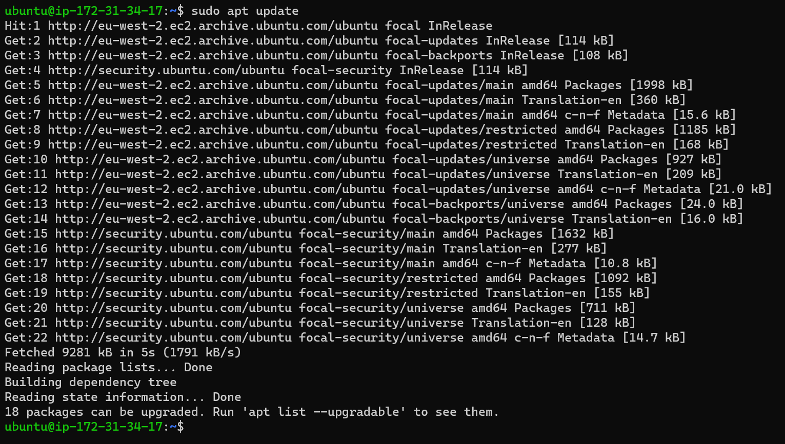

#run apache2 package installation

`sudo apt install apache2`
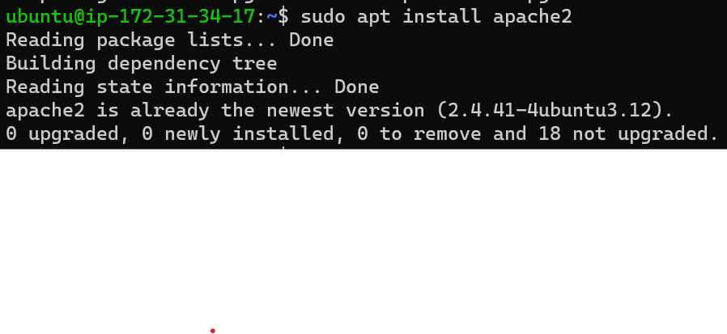
#To verify that apache2 is running as a Service in my OS
`sudo systemctl status apache2`
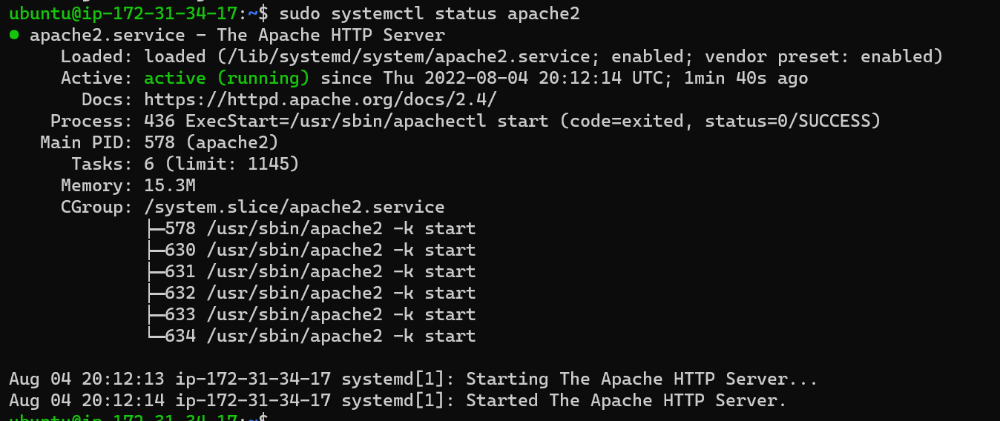

#To publicly access your webserver on your browser add new security rule to open TCP port 80 
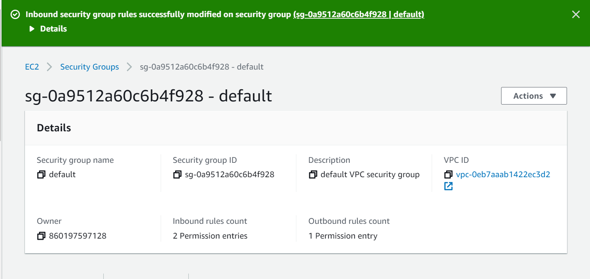

#testing the Apache HTTP server to respond to requests from the Internet by opening [Public_link]( http://<Public-IP-Address>:80)
 in any browser

## **STEP 2** - *MySQL INSTALLATION*

#Install MYSQL

`sudo apt install mysql-server`
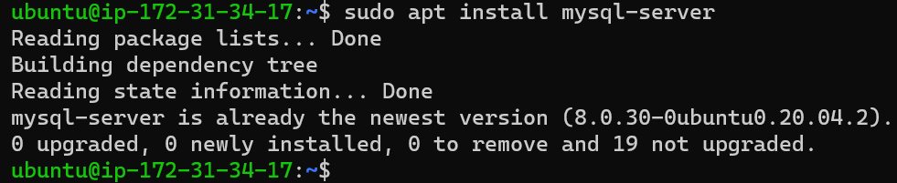

#Confirm mysql is running by running

`sudo systemctl status mysql`
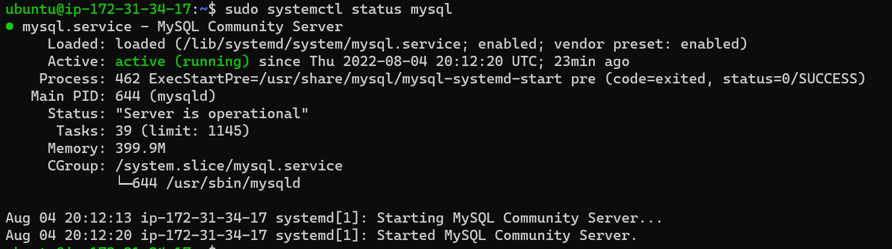

#log in to the MySQL

`sudo mysql`

#Exit MySQL 

`mysql > exit`

#Start the interactive scrip

`sudo mysql_secure_installation`

#Follow steps to set password.

#When completed log in to MySQL 

`sudo mysql -p`
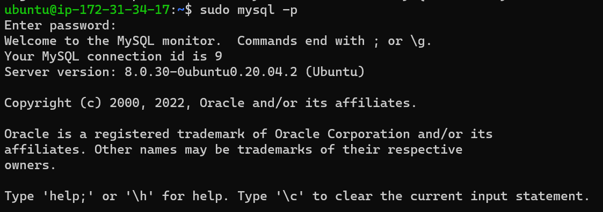

#Exit MySQL
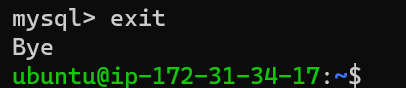

## **STEP 3** - *INSTALLING PHP*
#To install these 3 packages at once, run:

`sudo apt install php libapache2-mod-php php-mysql`
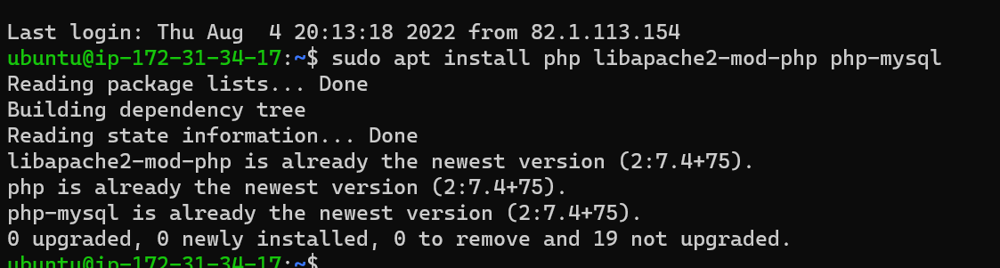

#to confirm your PHP version:

`php -v`
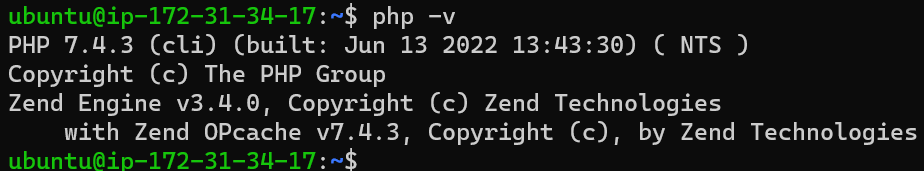

## **STEP 4** — *CREATING A VIRTUAL HOST FOR YOUR WEBSITE USING APACHE*

#Create the directory for ProjectToby using mkdir

`sudo mkdir /var/www/projectToby`
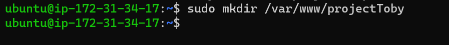

#To assign ownership of the directory:

` sudo chown -R $USER:$USER /var/www/projectToby`

#create and open a new configuration file in Apache’s sites-available directory

` sudo vi /etc/apache2/sites-available/projectToby.conf`

#This will create a new blank file.Paste in the following bare-bones configuration by hitting on i on the keyboard to enter the insert mode, and paste the text:

<VirtualHost *:80>

    ServerName projectToby
    ServerAlias www.projectToby 
    ServerAdmin webmaster@localhost
    DocumentRoot /var/www/projectToby
    ErrorLog ${APACHE_LOG_DIR}/error.log
    CustomLog ${APACHE_LOG_DIR}/access.log combined
</VirtualHost>

#To save and close the file, simply follow the steps below:

1. Hit the esc button on the keyboard
2. Type :
3. Type wq. w for write and q for quit
4. Hit ENTER to save the file

#use the ls command to show the new file in the sites-available directory
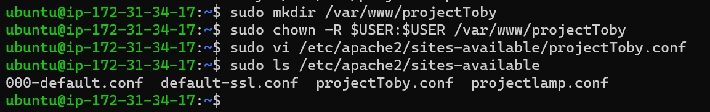

#use a2ensite command to enable the new virtual host:

` sudo a2ensite projectToby`
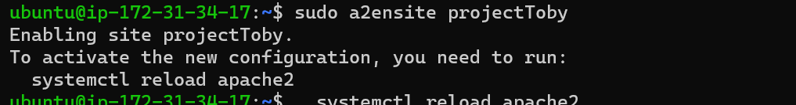

#To make sure your configuration file doesn’t contain syntax errors, run:

` sudo apache2ctl configtest`

#Finally, reload Apache so these changes take effect:
` sudo systemctl reload apache2`

#the new website is now active, but the web root /var/www/projectToby is still empty. To create an index.html file in that location so that we can test that the virtual host works as expected:

`sudo echo 'Hello LAMP from hostname' $(curl -s http://169.254.169.254/latest/meta-data/public-hostname) 'with public IP' $(curl -s http://169.254.169.254/latest/meta-data/public-ipv4) > /var/www/projectToby/index.html`

#open your website URL in your browser using your IP address. The result is shown below:

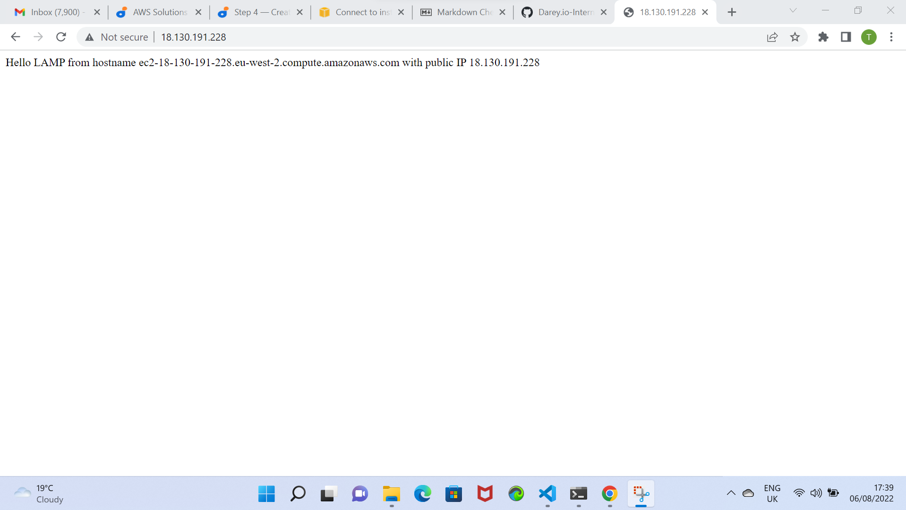

## **STEP 5** — *ENABLE PHP ON THE WEBSITE*

With the default DirectoryIndex settings on Apache, a file named index.html will always take precedence over an index.php file. This is useful for setting up maintenance pages in PHP applications, by creating a temporary index.html file containing an informative message to visitors. Because this page will take precedence over the index.php page, it will then become the landing page for the application. Once maintenance is over, the index.html is renamed or removed from the document root, bringing back the regular application page

#In case you want to change this behavior, you’ll need to edit the /etc/apache2/mods-enabled/dir.conf file and change the order in which the index.php file is listed within the DirectoryIndex directive:

` sudo vim /etc/apache2/mods-enabled/dir.conf`

`<IfModule mod_dir.c>
        #Change this:
        #DirectoryIndex index.html index.cgi index.pl index.php index.xhtml index.htm
        #To this:
        DirectoryIndex index.php index.html index.cgi index.pl index.xhtml index.htm
</IfModule>`
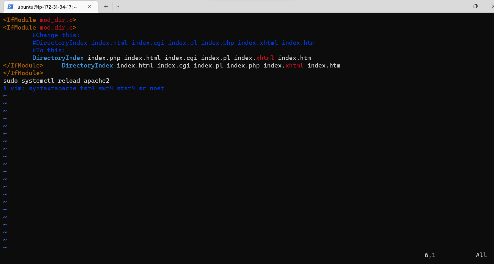

#After saving and closing the file, reload Apache so the changes take effect:

` sudo systemctl reload apache2`

#Finally, create a PHP script to test that PHP is correctly installed and configured on your server.

#Create a new file named index.php inside your custom web root folder:

` vim /var/www/projectToby/index.php`

#This will open a blank file. Add the following text:

`<?php
phpinfo();`

The result is shown below;
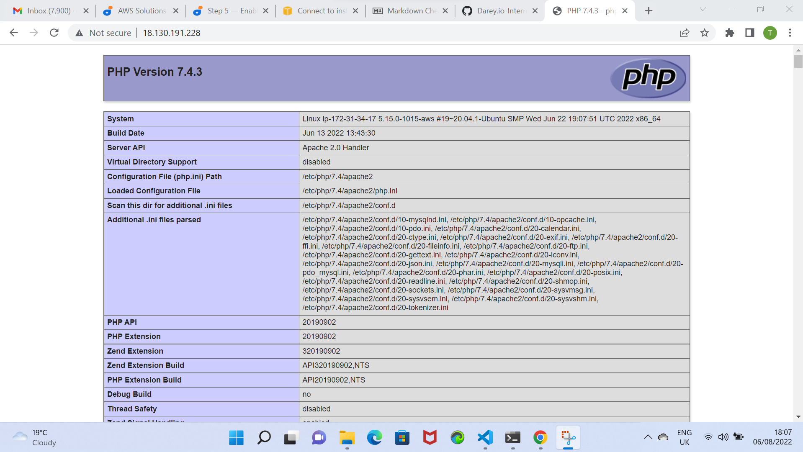

#The above contains sensitive information about your environment. To remove it run the command below:

` sudo rm /var/www/projectToby/index.php`

